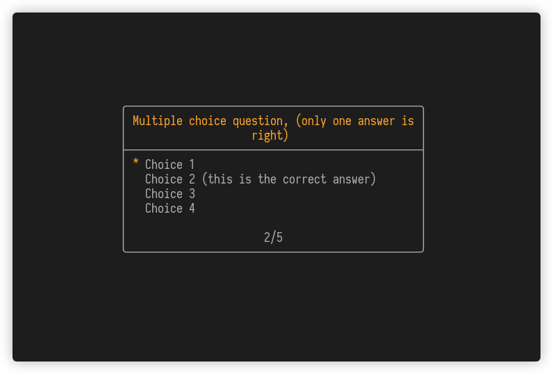
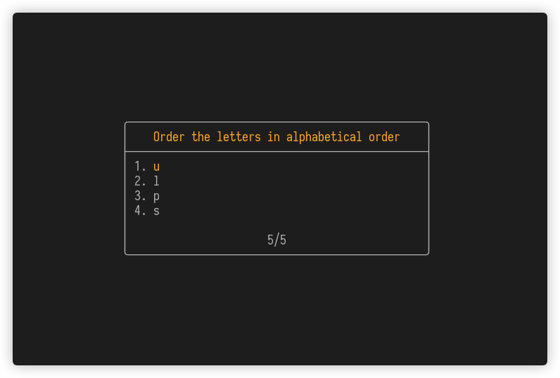

# hascard
A minimal commandline utility for reviewing notes. 'Flashcards' can be written in markdown-like syntax.


## Contents
- [Installation](#installation)
- [Usage](#usage)
- [Cards](#cards)
  - [Definition](#definition)
  - [Multiple choice](#multiple-choice)
  - [Multiple answer](#multiple-answer)
  - [Open question](#open-question)
- [Miscellaneous info](#miscellaneous-info)

## Installation
Installation on Windows is not possible sadly, aside from WSL. This is because hascard depends on vty which only supports unix operating systems (this includes macOS).

### Homebrew (for macOS)
For macOS users an installation using homebrew is provided via a custom tap. You can run 
```
brew update
brew install Yvee1/tools/hascard
```

### Binary
Linux and macOS binaries are available under [releases](https://github.com/Yvee1/hascard/releases/). To be able to run it from any directory, it has to be added to the PATH. This can be done by copying it to e.g. the `/usr/local/bin` directory.

### Snapcraft
Hascard is also on [snapcraft](https://snapcraft.io/hascard). Installation instructions are on that site. If you already have snap installed you can just install hascard via `sudo snap install hascard`. By default snap applications are isolated from the system and run in a sandbox. This means that hascard does not have permission to read or write any files on the system aside from those under `%HOME/snap/hascard`. To be able to read cards also in other directories under the home directory, hascard makes use of the `home` interface which might need to be enabled manually using `sudo snap connect hascard:home :home`.

**Note**: The installation with snapcraft does not work with all terminals, [known issues are with alacritty and st](https://github.com/Yvee1/hascard/issues/3), because of problems with terminfo that I do not know how to solve. With me, this did not happen with the other installation methods so try those if you have a somewhat non-standard terminal. If anyone knows what the problem might be, let me know!

### Install from source
Another option is to build hascard and install it from source. For this you can use the Haskell build tool called [stack](https://docs.haskellstack.org/en/stable/README/#how-to-install), or [nix](https://nixos.org/). Then for example clone this repository somewhere:
```
git clone https://github.com/Yvee1/hascard.git
cd hascard
```
and do `stack install hascard` or `nix-build` respectively.

## Usage
Simply run `hascard` to open the main application. Menu navigation can be done with the arrow keys or with the 'j' and 'k' keys. The controls for the different cards can be found at the bottom of the screen by default. This, and a couple other things, can be changed in the settings menu. Currently there is no functionality for making cards inside the hascard application itself, but they can easily be written in your favorite text editor since the syntax is human-friendly. 

### CLI
The CLI provides some options for running hascard; to see them all run `hascard -h`. As an example, say you have a file `deck.txt` with lots of cards in it and you want to review 5 random ones, you can use `hascard deck -s -a 5`. Here `-s` shuffles the deck and `-a 5` specifies we only want to look at 5 of them.

## Cards
Decks of cards are written in `.txt` files. Cards are seperated with a line containing three dashes `---`. For examples, see the [`/cards`](https://github.com/Yvee1/hascard/tree/master/cards) directory. In this section the 5 different types of cards are listed, with the syntax and how it is represented in the application.

### Definition
This is the simplest card, it simply has a title and can be flipped to show the contents. For example the following card
```
# Word or question
Explanation or definition of this word, or the answer to the question.
```
will result in


### Multiple choice
This is a typical multiple choice question. The question starts with a `#` and the choices follow. Only one answer is correct, and is indicated by a `*`, the other questions are preceded by a `-`. As an example, the following text

```
# Multiple choice question, (only one answer is right)
- Choice 1
* Choice 2 (this is the correct answer)
- Choice 3
- Choice 4
```

gets rendered as


### Multiple answer
Multiple choice questions with multiple possible answers is also possible. Here again the question starts with `#` and the options follow. Preceding each option is a box `[ ]` that is filled with a `*` or a `x` if it is correct. For example

```
# Multiple answer question
[*] Option 1 (this is a correct answer)
[ ] Option 2
[*] Option 3 (this is a correct answer)
[ ] Option 4
```
results in


### Open question
Open questions are also supported. The words that have to be filled in should be surrounded by underscores `_`. Multiple answer possibilities can also be given by seperating them with vertical bars `|`. As an example, the card

```
# Fill in the gaps
The symbol € is for the currency named _Euro_, and is used in the _EU|European Union_.
```
behaves like this


### Reorder question
This is a question where you have to put the elements in the correct order. Each element is preceded by a number indicating their correct place. The elements are rendered in the same order as they are written. For example the card

```
# Order the letters in alphabetical order
4. u
1. l
2. p
3. s
```
will look like


## Miscellaneous info
Written in Haskell, UI built with [brick](https://github.com/jtdaugherty/brick) and parsing of cards done with [parsec](https://github.com/haskell/parsec). Recordings of the terminal were made using [terminalizer](https://github.com/faressoft/terminalizer). The filebrowser widget was mostly copied from the brick [filebrowser demo program](https://github.com/jtdaugherty/brick/blob/master/programs/FileBrowserDemo.hs). Homebrew and Travis configurations were made much easier by [the tutorial from Chris Penner](https://chrispenner.ca/posts/homebrew-haskell).
